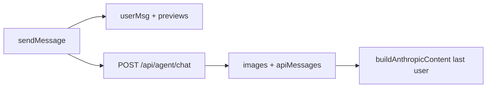

# Tomorrow workflow plan (priority order)

## Context from codebase (audit)

### P1 – “Images disappear” after send

- In `[agent-dashboard/src/AgentDashboard.jsx](agent-dashboard/src/AgentDashboard.jsx)`, `sendMessage` already pushes a user message with `**attachedImagePreviews**` (data URLs) at **1090–1098**, and the thread renders thumbnails at **2225–2230** when `msg.attachedImagePreviews` exists.
- Input bar clearing is `**setAttachedImages([])`** at **1100**—expected; the gap is almost certainly **persistence**: worker chat path persists user text via `INSERT INTO agent_messages ... content` only (e.g. `[worker.js](worker.js)` **5018–5021**, **5216–5219**) with **no image URLs or previews**, so after reload or history sync the UI has no `attachedImagePreviews`.
- **Frontend-only fix (as you asked):** when building `userMsg`, also add durable `**url`(s)** (e.g. HTTPS from CF Images when the attachment is a remote screenshot, or keep `dataUrl` for local paste). Extend the render branch at **2225+** to show `**type: "image"`** / `**url`** messages if you split them into separate thread entries, **or** keep one bubble but ensure the stored shape matches what you’ll later persist (same file: hydration from API can map `content` JSON or a convention you choose).

### P2 – Vision + “tool_defs: 0” / Haiku

- Client sends `**images: imagesToSend`** with `**messages`** and `**stream: useStreaming`** (`[AgentDashboard.jsx](agent-dashboard/src/AgentDashboard.jsx)` **1120–1128**). `imagesToSend` is captured **before** clearing attachments (**1086**, **1100**), so the client is not clearing the array used in the POST body.
- Worker builds `**images`** from body (**4666**) and, for **Anthropic streaming**, applies `**buildAnthropicContent(m.content, images)`** on the last user message (`[worker.js](worker.js)` **5055–5058**), which expects `**img.dataUrl`** and `**parseDataUrl`** (**3353–3361**). Remote HTTPS screenshots must be **fetched and converted to data URLs** in `handleBrowserScreenshotUrl` (already does **FileReader**)—that remains valid for Anthropic base64 blocks.
- **Root cause of `toolDefinitions.length === 0` with streaming:** `[worker.js](worker.js)` **4902–4904** sets `**useTools = supportsTools && !wantStream`**. When `**body.stream === true`**, tools are disabled and `**toolDefinitions` is never populated** (**4904–4935**). Logs at **5189** will show `**useTools: false`** whenever streaming is on (if you saw `useTools: true`, that was a non-stream request or different build).
- **Action tomorrow:** decide product behavior: **(A)** agent mode with tools → **turn off streaming** for that path, or **(B)** extend worker to run **tool loop + SSE** (larger change). For vision-only without tools, streaming + `images` array should already work if `dataUrl` is present.

### P3 – Browser preview UI (screenshot above preview)

- In `[agent-dashboard/src/FloatingPreviewPanel.jsx](agent-dashboard/src/FloatingPreviewPanel.jsx)`, structure is **iframe `liveUrl` first** (**1175–1180**), then **scrollable div** with loading / `**`** (**1182–1198**). **Surgical reorder** only (per project rules): render snapshot block **above** the live iframe (state line numbers before edit).

### P4 – `upsertMcpAgentSession` binding bug

- `[worker.js](worker.js)` **6561–6570**: `VALUES` has **seven** `?` placeholders; `**.bind(..., nowUnix, nowUnix, nowUnix)`** passes **eight** values (three `nowUnix`). **Fix:** use **two** unix timestamps for `created_at` / `updated_at` (`.bind(..., nowUnix, nowUnix)`), matching seven placeholders total: `uuid`, `agentIdForRow`, `conversationId`, `now`, `panel`, `nowUnix`, `nowUnix`.

### P5 – Remove `DASHBOARD` from Playwright gate

- Inline screenshot path: `**if (env.MYBROWSER && env.DASHBOARD && env.DB)`** at **[~4453](worker.js)** (storage is now CF Images). Other references: **1905**, **2837**, **6251**, **6583**, **10006**, **10071**—audit each: drop `**&& env.DASHBOARD`** only where Playwright no longer needs R2 (internal tools may still use R2 in some branches; read each block before editing).

### P6 – Double-fire `onBrowserScreenshotUrl` in FloatingPreviewPanel

- `[FloatingPreviewPanel.jsx](agent-dashboard/src/FloatingPreviewPanel.jsx)`: callback on completion **417** and `**useEffect` on `browserImgUrl`** **435–437**. **Fix:** keep **one** path (recommend **poll completion only**; remove the effect or guard with a ref so attach runs once per capture).

### P7 – Sprint 1 Build 3: git action cards

- Prior art: session log entries for **Build 1 / Build 2**; master plan mentions **POST `/api/agent/execute-action`**, `**actions[]` in chat**, UI action cards (`[docs/AGENT_SAM_WORKSTATION_MASTER_PLAN.md](docs/AGENT_SAM_WORKSTATION_MASTER_PLAN.md)` **257**).
- **Scope for Build 3:** define minimal `**actions[]`** shape from assistant (or tool result), render **git-oriented cards** in `[AgentDashboard.jsx](agent-dashboard/src/AgentDashboard.jsx)` message list (pattern like terminal/deploy pills in Build 2), and either stub `**/api/agent/execute-action`** or reuse `**/api/agent/commands/execute`** with a fixed command mapping—confirm desired UX before coding.

## Suggested execution order tomorrow

1. **P4** (one-line bind fix) + **P5/P6** small worker/UI fixes—low risk, stops log noise / double attach.
2. **P1** thread persistence shape + render (frontend; align with future DB if you add JSON in `agent_messages` later).
3. **P2** clarify streaming vs tools; then either client flag or worker feature.
4. **P3** layout reorder.
5. **P7** spec + implement git action cards.

## Approvals / rules reminder

- `**FloatingPreviewPanel.jsx`**: surgical edits only—cite line numbers before changing.
- `**worker.js`**: avoid OAuth handlers; Playwright/bind fixes are outside locked regions.
- **Deploy:** only after explicit **deploy approved**; R2 upload rules apply only if `dashboard/` assets change.

