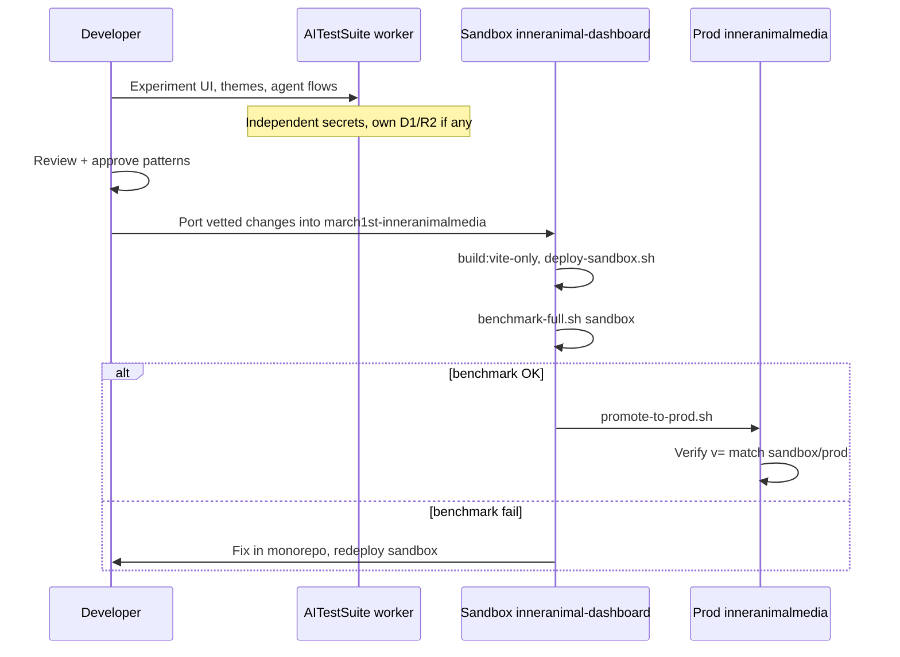

# AITestSuite + Inner Animal Media stack integration

**Purpose:** Wireframe and runbook for how the dedicated **AITestSuite** worker (`https://aitestsuite.meauxbility.workers.dev/`) fits into the Inner Animal Media (IAM) platform as **Step 1** — an independent AI/UI development zone — and how work flows from there into the existing **sandbox** and **production** pipeline.

**Last updated:** 2026-04-01

### Shell version and CICD audit (meauxcad repo)

| Item | Source |
|------|--------|
| **Displayed shell version** (status bar `vX.Y.Z`) | `src/shellVersion.ts` (`SHELL_VERSION`) — keep in sync with `package.json` `version`. |
| **Cache-bust `?v=` on `index.html` assets** | `npm run deploy` runs `scripts/bump-cache.js` which sets `?v=<semver>-<unix_ms>` so every deploy gets a unique query string. |
| **Worker API version string** | `worker.ts` imports `SHELL_VERSION` from `src/shellVersion.ts`. |
| **D1 CICD audit after a deploy** | Apply migration **207** (AITestSuite shell SQL in `migrations/`) to `inneranimalmedia-business` (see `docs/CICD_TABLES_AND_MIGRATIONS.md`). Update `207` or add `208+` when you bump past **v1.2.0**. |
| **Status bar workspace** | meauxcad `src/ideWorkspace.ts` — pinned welcome workspace vs **Connect Native Folder** (local wins); branch from `localStorage` `meauxcad_git_branch` (default `main`); Monaco cursor when **Code** tab has a file. |

---

## 1. How we keep using `github.com/SamPrimeaux/meauxcad.git`

The Cloudflare Workers **Build** integration does not require the GitHub repository name to match the Worker name.

| Concept | Value |
|--------|--------|
| **Git repository (source of truth)** | `https://github.com/SamPrimeaux/meauxcad.git` |
| **Cloudflare Worker name** | `aitestsuite` |
| **Public URL** | `https://aitestsuite.meauxbility.workers.dev/` |
| **Build root** | `/` (repo root) |
| **Production branch** | `main` |

**What to verify in the Cloudflare dashboard**

1. **Workers & Pages** → **aitestsuite** → **Settings** → **Builds** → Git repository shows **SamPrimeaux/meauxcad** and branch **main**.
2. Repo root contains **`wrangler.jsonc`** with `"name": "aitestsuite"` (Wrangler v3.109+ may open PRs if this drifts).
3. Build command: `npm run build`; deploy: `npx wrangler deploy` (as you configured).

**Optional later:** Rename the GitHub repo to `aitestsuite` for clarity. If you do, update the Cloudflare Git connection to the new URL and push `wrangler.jsonc` from the renamed repo so builds keep working. Until then, **meauxcad.git is correct** and is the canonical remote for this Worker.

**Retired hostname:** `https://aitesting.meauxbility.workers.dev` was removed. Any docs, D1 `worker_registry` rows, or `project_memory` keys that still reference `aitesting` should be updated to **`aitestsuite`** when you next touch that data.

---

## 2. IAM platform: three compute surfaces (mental model)

Inner Animal Media is not one Worker. Operationally you have **three** distinct surfaces:

```
┌─────────────────────────────────────────────────────────────────────────────┐
│                         INNER ANIMAL MEDIA — COMPUTE LAYERS                  │
├─────────────────────────────────────────────────────────────────────────────┤
│                                                                             │
│  [A] PRODUCTION                    inneranimalmedia (main monorepo)         │
│      URL: https://inneranimalmedia.com                                      │
│      Dashboard: /dashboard/agent                                            │
│      Role: Live product, OAuth, D1 prod, R2 agent-sam, full routes          │
│                                                                             │
│  [B] SANDBOX (CICD)                inneranimal-dashboard                    │
│      URL: https://inneranimal-dashboard.meauxbility.workers.dev             │
│      Role: Mirror prod worker + sandbox R2 (agent-sam-sandbox-cicd);        │
│            benchmark gate before promote; same APIs at lower risk           │
│                                                                             │
│  [C] AITESTSUITE (LAB)             aitestsuite (meauxcad repo)              │
│      URL: https://aitestsuite.meauxbility.workers.dev/                      │
│      Role: Dedicated **independent** IDE shell — Monaco, Excalidraw,        │
│            in-IDE browser, provider keys (Gemini, OpenAI, etc.) for         │
│            rapid UI/UX and agent experiments **without** touching           │
│            sandbox or prod deploy queues                                    │
│                                                                             │
└─────────────────────────────────────────────────────────────────────────────┘
```

**Important:** AITestSuite is **additive**. It does not replace the sandbox. The sandbox remains the **mandatory** gate for the `march1st-inneranimalmedia` monorepo (`deploy-sandbox.sh` → benchmark → `promote-to-prod.sh`).

---

## 3. ASCII wireframe: where AITestSuite sits in the flow

```
                    DEVELOPER / DESIGNER
                              │
                              v
         ┌────────────────────────────────────────┐
         │  STEP 1 — AITestSuite (this document)   │
         │  aitestsuite.meauxbility.workers.dev    │
         │  • Fast iteration on IDE chrome        │
         │  • Monaco / Draw / Browser tabs        │
         │  • Gemini + OpenAI (keys on worker)    │
         │  • No IAM prod OAuth / no prod D1      │
         └──────────────────┬─────────────────────┘
                            │  "approved" UI / behavior
                            v
         ┌────────────────────────────────────────┐
         │  STEP 2 — SANDBOX (CICD)                │
         │  inneranimal-dashboard.meauxbility...   │
         │  • agent-dashboard build + worker.js    │
         │  • ./scripts/deploy-sandbox.sh          │
         │  • ./scripts/benchmark-full.sh sandbox  │
         └──────────────────┬─────────────────────┘
                            │  benchmark PASS
                            v
         ┌────────────────────────────────────────┐
         │  STEP 3 — PRODUCTION PROMOTE            │
         │  inneranimalmedia.com                   │
         │  • ./scripts/promote-to-prod.sh         │
         │  • (Sam: deploy approved)               │
         └────────────────────────────────────────┘
```

---

## 4. Mermaid: promotion sequence (conceptual)



---

## 5. What lives where (quick reference)

| Concern | AITestSuite | Sandbox | Production |
|--------|-------------|---------|------------|
| **Repo** | SamPrimeaux/meauxcad | SamPrimeaux/inneranimalmedia-agentsam-dashboard (CI) + local monorepo | march1st-inneranimalmedia |
| **Worker name** | `aitestsuite` | `inneranimal-dashboard` | `inneranimalmedia` |
| **Primary use** | UI lab, provider smoke tests | Full IAM mirror + benchmarks | Live users |
| **Typical secrets** | GEMINI, OPENAI, CLOUDFLARE_API_TOKEN, etc. | Same class as prod (subset) | Full vault |
| **Promotion** | N/A (source is decisions, not auto-promote) | Required before prod | Final |

---

## 6. Secrets you listed (AITestSuite worker)

These belong **only** on the `aitestsuite` Worker unless the same secret is also required on sandbox/prod for a shared feature:

- `GEMINI_API_KEY`
- `OPENAI_API_KEY`
- `CLOUDFLARE_API_TOKEN`
- `CLOUDCONVERT_API_KEY`
- `MESHYAI_API_KEY`

Rotate and scope tokens per environment (lab vs prod) where Cloudflare and provider consoles allow.

---

## 7. Observability

- **Workers Logs / Traces:** Enabled on `aitestsuite` — use for debugging lab builds without tailing production.
- **Tail Worker:** `inneranimalmedia-tail` — aligns lab telemetry with the rest of the account; filter by Worker name in Logs.

---

## 8. Operational checklist (keep the stack honest)

1. **Git:** Every deploy of AITestSuite comes from **meauxcad** `main` unless you change branch rules.
2. **Wrangler:** Commit `wrangler.jsonc` with `"name": "aitestsuite"` in that repo so local `npx wrangler deploy` matches CI.
3. **IAM monorepo:** Feature work that must ship on **inneranimalmedia.com** still flows: **implement or port** into `march1st-inneranimalmedia` → sandbox → prod (not only AITestSuite).
4. **D1/registry:** If `worker_registry` or migrations still say `aitesting`, schedule a small follow-up to point URLs and script names to **`aitestsuite`**.

---

## 9. One-line summary

**AITTestSuite** is the **independent Step 1 lab** on `https://aitestsuite.meauxbility.workers.dev/`, backed by **`https://github.com/SamPrimeaux/meauxcad.git`**, for optimal UI and AI integration refinements; **approved** changes are then **ported** into the **inneranimal-dashboard** sandbox, **benchmarked**, and **promoted** to **inneranimalmedia** production using the existing CICD pipeline.

---

## 10. Sandbox `/dashboard/agent` vs aitestsuite (layout)

**Why they looked different:** `dashboard/agent.html` wrapped the React app in the **full IAM dashboard shell** (topbar + 240px sidenav + status bar). [aitestsuite](https://aitestsuite.meauxbility.workers.dev/) is a **standalone** IDE with no that shell. Stacking a second “Explorer” chrome inside React made the sandbox worse.

**Fix (HTML/CSS):** On the agent page, `body` gets class **`agent-ide-standalone`**, which **hides** `.topbar` and `.sidenav` and sizes **`.main-content.agent-page-main`** to `calc(100vh - 24px)` so the React surface fills the viewport (status bar only). See `dashboard/agent.html` inline styles.

**Full parity with meauxcad** (Explorer tree + Monaco center + right agent) still requires **porting or embedding** the meauxcad `App` layout into `agent-dashboard` or a dedicated route — not only CSS.

**Deploy:** `cd agent-dashboard && npm run build:vite-only && cd .. && ./scripts/deploy-sandbox.sh`; upload **`dashboard/agent.html`** to R2 whenever it changes (same as other dashboard HTML).
