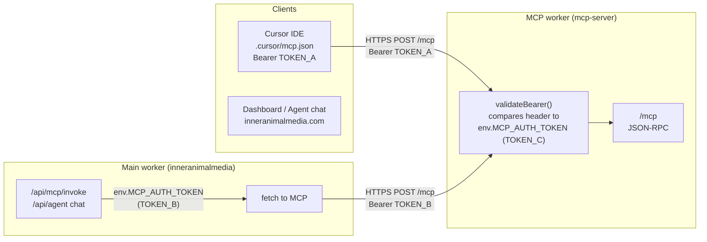

# MCP + InnerAnimalMedia: 2D wireframe and token sync

## Mermaid: request flow and token sources



## Text wireframe (same idea)

```
+------------------+                    +---------------------------+
| Cursor           |  Bearer TOKEN_A    | mcp.inneranimalmedia.com  |
| .cursor/mcp.json | ----------------->| validateBearer()           |
+------------------+                    |   expects env.MCP_AUTH_   |
                                        |   TOKEN (TOKEN_C)         |
+------------------+   Bearer TOKEN_B  |   /mcp -> tools, init     |
| Main worker      | ----------------->|   (mcp-server/src/index)  |
| worker.js        |   (env.MCP_AUTH_  +---------------------------+
| /api/mcp/invoke  |    TOKEN)          |
| invokeMcpTool..  |                   
+------------------+                   
```

## Why you get token mismatch every day

**Three places must hold the same secret:**

| Place | What | Set by |
|-------|------|--------|
| **1. mcp-server** (Cloudflare) | Secret `MCP_AUTH_TOKEN` | `wrangler secret put MCP_AUTH_TOKEN` in **mcp-server** project |
| **2. inneranimalmedia** (Cloudflare) | Secret `MCP_AUTH_TOKEN` | `wrangler secret put MCP_AUTH_TOKEN` in **main** project (wrangler.production.toml) |
| **3. Cursor** | `.cursor/mcp.json` → `headers.Authorization: "Bearer <token>"` | You edit the file (and must restart MCP) |

If any one is different:
- Cursor 401: Cursor’s token (TOKEN_A) != mcp-server’s TOKEN_C.
- Dashboard/agent 401 or “MCP auth not configured”: main worker’s TOKEN_B != mcp-server’s TOKEN_C, or main worker has no secret.

The rule file `.cursor/rules/mcp-reference.mdc` also contains a **hardcoded** token in the health-check curl. That can drift from the real secret and is a fourth copy to keep in sync (or remove from the rule and say “use token from .cursor/mcp.json”).

## One-time sync checklist

1. Pick **one** canonical token (e.g. generate once: `openssl rand -hex 32`).
2. Set it on **mcp-server**:
   - `cd mcp-server && ./scripts/with-cloudflare-env.sh npx wrangler secret put MCP_AUTH_TOKEN --remote -c wrangler.jsonc`
   - Paste the canonical token.
3. Set the **same** value on the main worker:
   - Repo root, with wrangler.production.toml:  
     `./scripts/with-cloudflare-env.sh npx wrangler secret put MCP_AUTH_TOKEN --remote -c wrangler.production.toml`
   - Paste the same token.
4. Put the **same** token in `.cursor/mcp.json` under `mcpServers["inneranimalmedia-mcp"].headers.Authorization` as `Bearer <token>`.
5. (Optional) Update `.cursor/rules/mcp-reference.mdc`: either set the health-check curl to use that same token or replace the example with “use the token from .cursor/mcp.json” so there’s only one source of truth in the repo.

After that, MCP (Cursor and dashboard) should stop 401’ing as long as no one changes one of the three (or four) places without updating the others.
