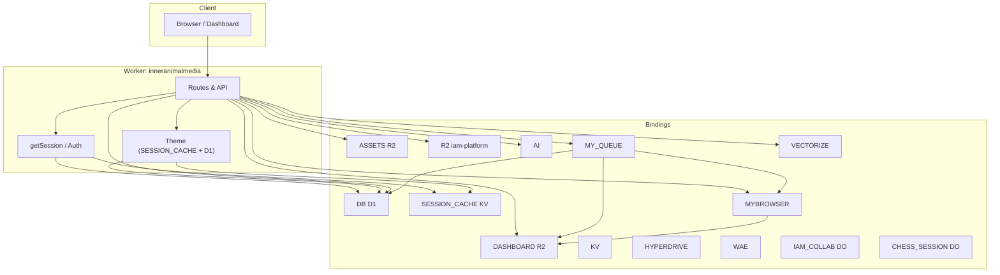

# Inner Animal Media — 2D Wireframe Technical Overview

Technical overview of the platform: bindings, routes, data flow, and integrations. No code changes — reference only.

---

## 1. High-level architecture (wireframe)

```
┌─────────────────────────────────────────────────────────────────────────────────────────┐
│                              CLOUDFLARE EDGE (Worker)                                    │
│  Worker: inneranimalmedia (worker.js)                                                    │
│  Routes: inneranimalmedia.com/*, www.*, webhooks.*                                       │
└─────────────────────────────────────────────────────────────────────────────────────────┘
         │              │              │              │              │              │
         ▼              ▼              ▼              ▼              ▼              ▼
┌──────────────┐ ┌──────────────┐ ┌──────────────┐ ┌──────────────┐ ┌──────────────┐ ┌──────────────┐
│ R2 ASSETS    │ │ R2 DASHBOARD  │ │ R2 R2        │ │ D1 DB        │ │ KV           │ │ SESSION_CACHE│
│ (public      │ │ (agent-sam)   │ │ (iam-platform│ │ (inneranimal-│ │ (09438d5e..) │ │ (dc87920b..) │
│  homepage,   │ │ dashboard     │ │  memory,     │ │  media-      │ │ generic KV   │ │ theme,       │
│  static)     │ │ HTML/JS/CSS,  │ │  logs)       │ │  business)   │ │              │ │ oauth state  │
│              │ │ screenshots)  │ │              │ │              │ │              │ │              │
└──────────────┘ └──────────────┘ └──────────────┘ └──────────────┘ └──────────────┘ └──────────────┘
         │              │                    │              │
         ▼              ▼                    ▼              ▼
┌──────────────┐ ┌──────────────┐ ┌──────────────┐ ┌──────────────┐
│ R2           │ │ AI           │ │ MYBROWSER   │ │ MY_QUEUE     │
│ CAD_ASSETS   │ │ (Workers AI) │ │ (Playwright)│ │ (Queue       │
│ (splineicons)│ │              │ │             │ │  producer +  │
└──────────────┘ └──────────────┘ └──────────────┘ │  consumer)   │
                                                    └──────────────┘
┌──────────────┐ ┌──────────────┐ ┌──────────────┐
│ HYPERDRIVE   │ │ VECTORIZE   │ │ WAE          │
│ (9108dd64..) │ │ (ai-search- │ │ (Analytics   │
│ (DB conn     │ │  inneranimal-│ │  Engine      │
│  pooling)    │ │  media-      │ │  dataset)    │
│              │ │  aisearch)   │ │              │
└──────────────┘ └──────────────┘ └──────────────┘

┌─────────────────────────────────────────────────────────────────────────────────────────┐
│ DURABLE OBJECTS (stubs in worker; same process)                                          │
│  IAM_COLLAB (IAMCollaborationSession)  │  CHESS_SESSION (ChessRoom)                      │
└─────────────────────────────────────────────────────────────────────────────────────────┘
```

---

## 2. Bindings reference (wrangler.production.toml)

| Binding         | Type        | Resource / ID | Purpose |
|-----------------|------------|----------------|---------|
| **AI**          | `[ai]`     | Workers AI     | LLM inference (chat, agent, RAG). |
| **MYBROWSER**   | `[browser]`| Cloudflare Browser Rendering | Playwright: screenshots, health, metrics, overnight before-screenshots, MCP tools (playwright_screenshot, browser_srowser_screenshot, browser_navigate, browser_content). |
| **ASSETS**      | R2         | `inneranimalmedia-assets` | Public site assets (homepage, static files). Served when path doesn’t match dashboard or API. |
| **CAD_ASSETS**  | R2         | `splineicons`  | CAD/spline assets. |
| **DASHBOARD**   | R2         | `agent-sam`    | Dashboard HTML (static/dashboard/*.html, dashboard/*.html fallback), fragments (static/dashboard/pages/*), scripts (Finance.jsx, etc.), screenshots, reports, overnight script. |
| **R2**          | R2         | `iam-platform` | Memory/docs: e.g. memory/schema-and-records.md, memory/daily/*.md. Not dashboard or worker source. |
| **DB**          | D1         | `inneranimalmedia-business` (cf87b717-d4e2-4cf8-bab0-a81268e32d49) | All SQL: auth_sessions, user_settings, user_preferences, cms_themes, agent_*, playwright_jobs, cloudflare_deployments, spend_ledger, project_time_entries, roadmap_steps, mcp_*, otlp_traces, etc. |
| **KV**          | KV         | 09438d5e4f664bf78467a15af7743c44 | Generic key-value (if used beyond SESSION_CACHE). |
| **SESSION_CACHE**| KV         | dc87920b0a9247979a213c09df9a0234 | Theme cache key `theme:{user_id}`, OAuth state keys `oauth_state_*`, `oauth_state_github_*`. TTL 3600 for theme. |
| **MY_QUEUE**    | Queue      | 74b3155b36334b69852411c083d50322 | Producer: enqueue Playwright jobs (screenshot/render). Consumer: same worker; runs Playwright, writes to DASHBOARD R2, updates playwright_jobs in DB. |
| **HYPERDRIVE**  | Hyperdrive| 9108dd6499bb44c286e4eb298c6ffafb | DB connection pooling (external DB if configured). |
| **VECTORIZE**   | Vectorize  | `ai-search-inneranimalmedia-aisearch` | RAG embeddings and vector search. |
| **WAE**         | Analytics Engine | `inneranimalmedia` | Observability dataset. |
| **IAM_COLLAB**  | Durable Object | IAMCollaborationSession | Stub: returns JSON ok. |
| **CHESS_SESSION** | Durable Object | ChessRoom | Stub: returns JSON ok. |

**Environment variables (vars):**  
`CLOUDFLARE_ACCOUNT_ID`, `CLOUDFLARE_IMAGES_ACCOUNT_HASH`, `GITHUB_CLIENT_ID`, `GOOGLE_CLIENT_ID`, `TENANT_ID` (tenant_sam_primeaux).  
**Secrets (not in repo):** e.g. `RESEND_API_KEY`, `ANTHROPIC_API_KEY`, `OPENAI_API_KEY`, `MCP_AUTH_TOKEN`, etc.

---

## 3. Route map (worker request flow)

### 3.1 Health and telemetry

- `GET /api/health` — Worker health; checks ASSETS + DASHBOARD.
- `POST /api/telemetry/v1/traces` — OTLP trace ingest → D1 `otlp_traces`.

### 3.2 Browser / Playwright (MYBROWSER)

- `GET /api/browser/screenshot?url=...` — Playwright screenshot (optional R2 cache).
- `GET /api/browser/health` — MYBROWSER status.
- `GET /api/browser/metrics` — Metrics for browser binding.
- `POST /api/playwright/screenshot` — Create job in D1, run Playwright sync or enqueue to MY_QUEUE.
- `GET /api/playwright/jobs/:id` — Job status and result_url.

### 3.3 Dashboard HTML and static

- `GET /dashboard` or `/dashboard/` → 302 to `/dashboard/overview`.
- `GET /dashboard/pages/<name>.html` → R2 `static/dashboard/pages/<name>.html` (fragment for shell).
- `GET /dashboard/<segment>` → R2 `static/dashboard/<segment>.html` else `dashboard/<segment>.html` (no-cache).
- `GET /static/dashboard/*` → R2 DASHBOARD (key `static/dashboard/...` or fallback `dashboard/...`; Finance/Billing/Clients .jsx name fallbacks).

### 3.4 Auth and session

- Session: cookie `session=<id>`; D1 `auth_sessions` (id, user_id, expires_at). `getSession(env, request)` used for protected routes.
- `POST /api/auth/login` — Validate credentials, create session, redirect to /dashboard/overview.
- `POST /api/auth/logout` — Clear cookie, redirect to sign-in.
- OAuth: `/api/oauth/google/start|callback`, `/api/oauth/github/start|callback` — State in SESSION_CACHE; callback creates session and redirects.

### 3.5 Settings and theme

- `GET /api/settings/theme` — Auth. Prefer SESSION_CACHE `theme:{user_id}`; else D1 user_settings / user_preferences + cms_themes → build variables; cache in SESSION_CACHE (3600s).
- `PATCH /api/settings/theme` — Auth. Body `{ theme: slug }`. Upsert D1 `user_settings(user_id, theme)`; invalidate/update cache.

### 3.6 Overview and dashboard APIs (session required where noted)

- `GET /api/overview/stats` — Overview stats.
- `GET /api/overview/recent-activity`, `/api/overview/checkpoints`, `/api/overview/activity-strip`, `/api/overview/deployments` — Activity and deploy data from D1 (e.g. cloudflare_deployments).
- `POST /api/dashboard/time-track/manual` — Time tracking manual entry.
- `GET/POST /api/dashboard/time-track/*` — Start/heartbeat/end session → D1 project_time_entries.

### 3.7 Finance, clients, projects, billing

- `GET /api/colors/all` — Colors for finance UI.
- `GET /api/finance/*` — Finance summary, transactions, health, AI spend (spend_ledger).
- `GET /api/clients` — Clients data.
- `GET /api/projects` — Projects.
- `GET /api/billing/summary` — Billing summary.

### 3.8 Agent dashboard and chat

- `GET /api/agent/boot` — Boot payload for agent UI.
- `GET /api/agent/terminal/ws` — Terminal WebSocket.
- `POST /api/agent/terminal/run`, `/api/agent/terminal/complete` — Terminal run/complete.
- `GET/POST /api/agent/sessions`, `GET /api/agent/sessions/:id/messages` — Sessions and messages (D1 agent_sessions, agent_messages).
- `POST /api/playwright/screenshot` — See above.
- `GET /api/playwright/jobs/:id` — See above.
- `GET /api/agent/workspace/:id` — Workspace.
- `GET /api/agent/models` — AI models (D1 ai_models).
- `POST /api/agent/chat` — Chat completion; streams; tool calls (MCP invoke, internal Playwright); writes agent_telemetry.
- `POST /api/agent/playwright` — Enqueue Playwright job (MY_QUEUE).
- `POST /api/agent/mcp` — MCP-related.
- `POST /api/agent/cidi`, `GET/POST /api/agent/telemetry` — Cidi and telemetry.
- `POST /api/agent/rag/query`, `/api/agent/rag/index-memory`, `/api/agent/rag/compact-chats` — RAG (VECTORIZE, embeddings).
- `GET /api/integrations/drive/list`, `/api/integrations/github/list`, `/api/integrations/status` — Integrations.
- `GET /api/agent/today-todo`, `PUT /api/agent/today-todo` — Today todo.
- `GET /api/agent/context/bootstrap`, `GET /api/agent/bootstrap` — Context bootstrap (e.g. schema-and-records from R2 iam-platform).

### 3.9 MCP

- `GET /api/mcp/status`, `/api/mcp/agents`, `/api/mcp/tools`, `/api/mcp/commands`, `POST /api/mcp/dispatch`, `GET /api/mcp/services`, `POST /api/mcp/invoke` — MCP status, tools, dispatch, invoke (external MCP server + internal Playwright tools when MYBROWSER + DASHBOARD).

### 3.10 R2 UI and workers

- `GET /api/r2/stats`, `POST /api/r2/sync`, `GET /api/r2/buckets`, `GET /api/r2/list`, `POST /api/r2/upload`, `DELETE /api/r2/delete`, `GET /api/r2/url`, `POST /api/r2/buckets/bulk-action` — R2 proxy/list/upload/delete; uses DASHBOARD and/or other R2 bindings as configured.
- `GET /api/workers` — Workers list (if implemented).

### 3.11 Admin and overnight

- `POST /api/admin/overnight/validate` — D1 check + before-screenshots (MYBROWSER) to R2 `reports/screenshots/before-YYYY-MM-DD/*.jpg`; optional proof email (Resend).
- `POST /api/admin/overnight/start` — Same screenshots + first pipeline email; set D1 OVERNIGHT_STATUS for cron.

### 3.12 Search and user preferences

- `GET /api/search` — Search (e.g. dashboard nav).
- `PATCH /api/user/preferences` — User preferences (legacy; theme prefer PATCH /api/settings/theme).

---

## 4. Queue consumer (MY_QUEUE)

- **Producer:** `POST /api/playwright/screenshot` (and optionally `POST /api/agent/playwright`) enqueues messages with `{ jobId, job_type: 'screenshot'|'render', url }`.
- **Consumer:** `worker.queue(batch, env, ctx)` — For each message: launch Playwright (MYBROWSER), goto url, then:
  - `screenshot` → screenshot → DASHBOARD.put(`screenshots/${jobId}.png`) → result_url in public R2 URL; update D1 `playwright_jobs` (status=completed, result_url).
  - `render` → page.content() → DASHBOARD.put(`renders/${jobId}.html`) → result_url; update D1.
- On failure: update `playwright_jobs` status=failed, error. Then `msg.ack()`.

---

## 5. R2 key conventions (DASHBOARD = agent-sam)

| Key pattern | Use |
|-------------|-----|
| `static/dashboard/<segment>.html` | Primary dashboard page (e.g. overview, cloud, mcp, tools). |
| `dashboard/<segment>.html` | Fallback dashboard page. |
| `static/dashboard/pages/<name>.html` | Fragment for shell (e.g. pages/cms.html). |
| `static/dashboard/*.js`, `*.css`, `*.jsx` | Scripts/styles (e.g. Finance.jsx, shell.css, styles_themes.css). |
| `screenshots/<id>.png` | Playwright screenshot output. |
| `renders/<id>.html` | Playwright render (full HTML) output. |
| `reports/screenshots/before-YYYY-MM-DD/<page>.jpg` | Overnight before-screenshots. |
| `scripts/overnight.js` | Overnight pipeline script reference. |

Public R2 base URL for agent-sam: `https://pub-b845a8f899834f0faf95dc83eda3c505.r2.dev/`.

---

## 6. D1 (DB) — main tables (canonical / notable)

- **Auth:** auth_sessions, user_settings, user_preferences.
- **Themes:** cms_themes.
- **Agent:** agent_sessions, agent_messages, ai_models, agent_telemetry, playwright_jobs, playwright_jobs_v2 (if present).
- **MCP:** mcp_registered_tools, mcp_services (and related).
- **Finance / cost:** spend_ledger.
- **Time:** project_time_entries, projects.
- **Deploy / activity:** cloudflare_deployments.
- **Roadmap / memory:** roadmap_steps, agent_memory_index, project_memory, ai_compiled_context_cache.
- **OTLP:** otlp_traces.
- **OAuth:** (e.g. user_oauth_tokens per migrations).

---

## 7. External services (outbound)

- **Resend** — Emails (overnight validate/start, digest). Requires `RESEND_API_KEY`.
- **Google OAuth** — Login. Uses vars + secrets.
- **GitHub OAuth** — Login. Uses vars + secrets.
- **Anthropic / OpenAI / etc.** — Chat and tools. Via AI binding or explicit API keys.
- **MCP server** — External (e.g. meauxbility workers). Invoked from `/api/mcp/invoke` and agent chat tool loop; auth via bearer token.
- **Cloudflare API** — If used (e.g. deployments, wrangler); via CLOUDFLARE_API_TOKEN or similar.

---

## 8. Cron triggers (wrangler.production.toml)

- Crons: `0 6 * * *`, `5 14 * * 1`, `0 9 * * *`, `0 8 * * *`, `0 4 * * *`, `0 3 * * *`, `0 14 * * *` (UTC). Used for overnight pipeline, digest, or other scheduled jobs (exact handlers in worker scheduled export).

---

## 9. Observability and tail

- **Observability:** enabled (logs, traces, head_sampling_rate 1, persist).
- **Tail consumer:** `inneranimalmedia-tail` — receives worker tail events.

---

## 10. Summary diagram (Mermaid)



---

*Generated from worker.js, wrangler.production.toml, and docs. No code or config was changed.*
