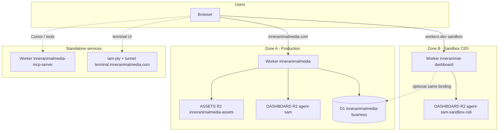
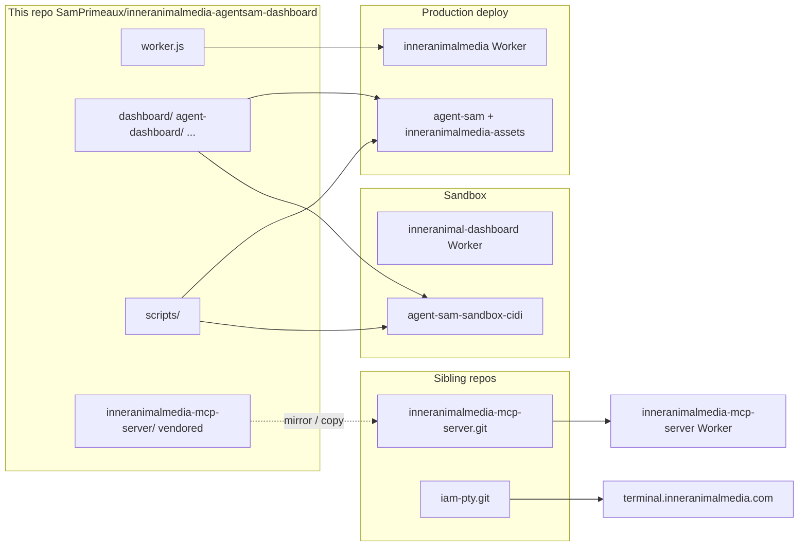
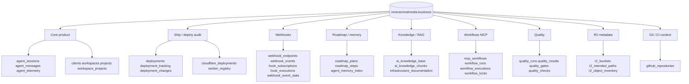

# Inner Animal Media — system architecture (2-zone CIDI + repos + D1)

**Purpose:** One visual + structured map so any agent (or human) knows **which Worker, bucket, repo, and DB tables** apply at each phase — reducing ambiguous edits and production accidents.

**Related handoffs:**  
`docs/CURSOR_HANDOFF_D1_CIDI_ORCHESTRATION.md` · `docs/CURSOR_HANDOFF_SANDBOX_UI_TO_PRODUCTION.md` · `docs/memory/D1_CANONICAL_AGENT_KEYS.md`

---

## 1. ASCII wireframe — two zones (production vs CIDI sandbox)

```
┌─────────────────────────────────────────────────────────────────────────────────────────┐
│                         ZONE A — PRODUCTION (customer-facing)                            │
├─────────────────────────────────────────────────────────────────────────────────────────┤
│  Browser ──► inneranimalmedia.com                                                        │
│       │                                                                                  │
│       └──► Worker: inneranimalmedia  (repo: THIS repo worker.js + wrangler.production)   │
│                 │                                                                        │
│                 ├── ASSETS (R2)     inneranimalmedia-assets  → /  , /about, marketing    │
│                 ├── DASHBOARD (R2)  agent-sam                → /dashboard/* , /auth/*    │
│                 ├── DB (D1)         inneranimalmedia-business  → sessions, APIs, tables  │
│                 ├── KV, AI, Browser, other bindings per wrangler.production.toml         │
│                 └── Routes     inneranimalmedia.com , www.*                                │
└─────────────────────────────────────────────────────────────────────────────────────────┘

┌─────────────────────────────────────────────────────────────────────────────────────────┐
│                    ZONE B — CIDI SANDBOX (UI / safe iteration)                             │
├─────────────────────────────────────────────────────────────────────────────────────────┤
│  Browser ──► inneranimal-dashboard.meauxbility.workers.dev                                 │
│       │                                                                                  │
│       └──► Worker: inneranimal-dashboard  (separate CF project; same patterns)          │
│                 │                                                                        │
│                 ├── ASSETS + DASHBOARD (R2)  agent-sam-sandbox-cidi  (mirror keys)       │
│                 ├── DB (often same D1) inneranimalmedia-business  ⚠ shared prod data     │
│                 └── No custom domain required; workers.dev URL                           │
└─────────────────────────────────────────────────────────────────────────────────────────┘

┌─────────────────────────────────────────────────────────────────────────────────────────┐
│                    STANDALONE WORKERS / SERVICES (not the main site Worker)               │
├─────────────────────────────────────────────────────────────────────────────────────────┤
│  MCP   mcp.inneranimalmedia.com  ──► Worker inneranimalmedia-mcp-server                   │
│        Repo: github.com/SamPrimeaux/inneranimalmedia-mcp-server  (also vendor in monorepo)│
│                                                                                          │
│  PTY   terminal.inneranimalmedia.com  ──► tunnel / isolate process                       │
│        Repo: github.com/SamPrimeaux/iam-pty  (backup / isolated PTY + tunnel story)       │
│        Dashboard may open terminal features; wiring is Worker + WS + tunnel, not R2 HTML  │
└─────────────────────────────────────────────────────────────────────────────────────────┘
```

**CIDI (2-step) UI lane (conceptual):**

```
  [ Edit in repo ] ──► [ Build Vite if needed ] ──► [ Upload to ZONE B R2 ] ──► verify sandbox URL
                                                              │
                                                              ▼ (human + PROMOTE_OK + deploy approved)
                                                      [ Upload to ZONE A R2 agent-sam ]
                                                              │
                                                              ▼
                                                      [ Deploy inneranimalmedia Worker if worker.js changed ]
```

Scripts: `scripts/upload-repo-to-r2-sandbox.sh` → `scripts/promote-agent-dashboard-to-production.sh`  
MCP workflow row: `mcp_workflows.id = wf_cidi_agent_ui_sandbox_to_prod`

---

## 2. Mermaid — high-level components



---

## 3. Mermaid — repos ↔ deploy units



**Note:** MCP may be developed in the **sibling GitHub repo**; this monorepo can contain a **copy** under `inneranimalmedia-mcp-server/` for convenience. Deploy rules: only `inneranimalmedia-mcp-server` Worker name from that folder’s `wrangler.toml`.

---

## 4. Mermaid — D1 table clusters (what agents touch when)



**Session-start keys (canonical tenant = `system`):**  
`agent_memory_index`: `active_priorities`, `build_progress`, `today_todo` — see `docs/memory/D1_CANONICAL_AGENT_KEYS.md`.

---

## 5. Quick reference — URLs and Worker names

| Role | URL or host | Worker / resource |
|------|-------------|-------------------|
| Production app | https://inneranimalmedia.com | **inneranimalmedia** |
| Sandbox dashboard | https://inneranimal-dashboard.meauxbility.workers.dev | **inneranimal-dashboard** |
| MCP | https://mcp.inneranimalmedia.com/mcp | **inneranimalmedia-mcp-server** |
| MCP health | https://mcp.inneranimalmedia.com/ | JSON `status: ok` ([service root](https://mcp.inneranimalmedia.com/)) |
| Terminal (PTY) | https://terminal.inneranimalmedia.com | **iam-pty** + tunnel (separate from main Worker) |
| Production dashboard R2 | — | **agent-sam** `static/dashboard/...` |
| Sandbox dashboard R2 | — | **agent-sam-sandbox-cidi** same key layout |

---

## 6. Rules agents must not break

- **OAuth:** Do not change `handleGoogleOAuthCallback` / `handleGitHubOAuthCallback` in `worker.js` without explicit approval.
- **Production deploy:** Only after Sam types **`deploy approved`** and correct `wrangler.production.toml` command.
- **MCP deploy:** Only from `inneranimalmedia-mcp-server/` with `npx wrangler deploy -c wrangler.toml`, Worker name **inneranimalmedia-mcp-server** exactly.
- **Dashboard HTML on R2:** Upload changed `dashboard/*.html` to **agent-sam** before relying on production; sandbox uses **agent-sam-sandbox-cidi** via `scripts/upload-repo-to-r2-sandbox.sh`.

---

## 7. Files in this repo that encode this system

| File | What it encodes |
|------|-----------------|
| `wrangler.production.toml` | Zone A Worker bindings (locked — do not change casually) |
| `worker.js` | Routing, APIs, webhooks → D1 tables |
| `scripts/d1-cidi-bootstrap-20260322.sql` | `r2_buckets` sandbox row, `mcp_workflows` CIDI, `worker_registry` touch-up |
| `scripts/upload-repo-to-r2-sandbox.sh` | Zone B R2 sync |
| `scripts/promote-agent-dashboard-to-production.sh` | Zone A agent bundle R2 promotion gate |
| `docs/CURSOR_HANDOFF_D1_CIDI_ORCHESTRATION.md` | D1 write discipline + webhooks + locks |
| `docs/CURSOR_HANDOFF_SANDBOX_UI_TO_PRODUCTION.md` | UI lane sandbox → prod |

---

*Last updated: 2026-03-22 — align with D1 bootstrap and handoff docs.*
