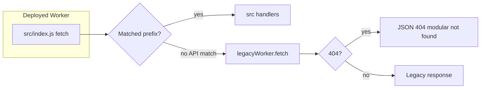

# Worker.js modular extraction audit

**Date:** 2026-05-01  
**Scope:** Read-only analysis. No `worker.js` or runtime behavior was modified for this document.  
**Goal:** Map `worker.js` to extraction targets, classify dead vs active paths, and define a phased migration that preserves production behavior.

---

## 1. Executive summary

| Finding | Detail |
|--------|--------|
| **Production entry** | `wrangler.production.toml` sets `main = "src/index.js"`. The deployed Worker’s **`fetch`** and **`scheduled`** handlers are **`src/index.js`**, not `worker.js` directly. |
| **Legacy role** | `worker.js` is imported as **`legacyWorker`** in `src/index.js`. Unmatched `/api/*` requests delegate to **`legacyWorker.fetch`** (fallback). **`queue`** explicitly forwards to **`legacyWorker.queue`**. |
| **Cron runtime gap (critical)** | `worker.js` defines **`worker.scheduled` twice**: an inner short handler (~3083–3105) is **overwritten** by assignment **`worker.scheduled = async function …`** (~27561–27641). Cloudflare **never invokes** `legacyWorker.scheduled` because **`src/index.js`** defines its **own** minimal `scheduled`. Therefore **the full cron matrix implemented on `worker.scheduled` (digest email, 6 AM RAG pipeline, financial cron, spend rollup, etc.) may not run in production** unless duplicated elsewhere—this must be validated against Workers Observability / cron logs. |
| **Duplication** | Several routes exist in **both** `src/index.js` and `worker.js` (e.g. `/api/health`, `/api/provider-colors`, `/api/system/health`). Modular router wins first; legacy duplicate is fallback-only for paths not matched earlier. |
| **Tenant literals** | `src/**/*.js` was cleaned of `tenant_sam_primeaux` / `tenant_inneranimalmedia`; **`worker.js` still contains hardcoded tenant strings** (see §5). |
| **Size** | `worker.js` ~34k lines; modular `src/**/*.js` ~31k lines—overlap + fallback explains partial redundancy. |

**Policy alignment:** Freeze **new business logic** in `worker.js`; add features under `src/api/*`, `src/core/*`, and thin compatibility stubs in `worker.js` only when unavoidable until extraction completes.

---

## 2. Line counts (commands run)

```text
34031 worker.js
 621 src/index.js
31338 total (src/**/*.js)
```

Largest modular API modules (illustrative): `src/api/agent.js`, `src/api/settings.js`, `src/api/integrations.js`, `src/api/workspaces.js`, `src/api/rag.js`, `src/api/storage.js`.

---

## 3. Architecture map

### 3.1 Request path



**References:**

- Modular fallback and 404 handling: `src/index.js` ~541–551 (`legacyWorker.fetch`).
- Queue forward: `src/index.js` ~617–619 (`legacyWorker.queue`).

### 3.2 `worker.js` object shape (file order)

| Lines (approx.) | Block | Notes |
|-----------------|-------|--------|
| 3082–6936 | `const worker = { … }` | Contains **`scheduled`** (first version), giant **`fetch`**, **`queue`**`. |
| 3083–3105 | First `scheduled` | **Dead after overwrite**—see §6. |
| 3106–6858 | `fetch` | Legacy routing + business logic; primary extraction surface. |
| 6859–6935 | `queue` | R2 docs indexing, Playwright jobs—still active via `src/index.js` delegation. |
| 27561–27641 | `worker.scheduled = async function …` | **Final** scheduled implementation on exported object (if Worker entry were `worker.js`). |
| 27642 | `export default worker` | Default export when `worker.js` is entry (not prod). |

Standalone helpers **after** line 6936 include OAuth handlers, `invokeMcpToolFromChat`, RAG helpers, etc.—still loaded when module imports `worker.js`.

---

## 4. `worker.js` fetch router — section comments (anchor ranges)

These comments mark major legacy regions **inside** `fetch` (approximate line ranges for extraction tickets).

| Approx. lines | Section marker (from grep) |
|---------------|---------------------------|
| 3116–3149 | Task 12: D1 proxy `/api/dashboard/d1/*` (Bearer `INTERNAL_API_SECRET`) |
| 3163–3196 | `/api/tools-proxy/*`, `tools.inneranimalmedia.com` + DASHBOARD |
| 3198–3268 | Health, billing handoff, `/health` |
| 3270+ | Agent Sam internal proxy `/api/agent-sam/*` |
| 3335+ | Webhooks canonical + legacy hooks |
| 3389 | CAD → dynamic `import('./src/api/cad.js')` (already delegated pattern) |
| 3391+ | Internal post-deploy, deployments, OTLP, browser, overview, time, finance, OAuth Google/GitHub, auth email, integrations, agent, MCP, storage, R2, vault, federated search, RAG (`/api/rag/*`), settings |
| 5676+ | Federated search, unified search, search debug (Hyperdrive sample) |
| 5803+ | Custom RAG ingest/query, Vectorize/Docs |
| 6020+ | Settings, IDE workspace metadata, themes, collab |
| 6671+ | Public ASSETS pages |

**Note:** Many of these have parallel implementations under `src/api/*`; the audit classifies them in §7.

---

## 5. Hardcoded tenant IDs in `worker.js`

`grep` hits (non-exhaustive but actionable):

| Lines (approx.) | Pattern |
|-----------------|--------|
| 3050, 3068, 3077, 3486, 27546, 27554 | `tenant_sam_primeaux` in SQL literals |
| 5574, 5609 | `'tenant_inneranimalmedia'` fallback for `user_connections` |
| 7507, 7657 | SQL / constants |
| 27546 | `agentsam_webhook_weekly` INSERT |
| 31383, 31565, 31930 | Session tenant fallback `tenant_sam_primeaux` |

**Risk:** Multi-tenant correctness and rollup attribution; align with `platformTenantIdFromEnv` / `fallbackSystemTenantId` patterns used in `src/`.

---

## 6. Scheduled handler: dead code + runtime certainty

1. **First `scheduled` (3083–3105):** Overwritten—**do not treat as active**.
2. **Second `scheduled` (27561–27641):** Full cron branching (`*/30`, midnight digest, 6 AM RAG, 9 AM financial, Monday rollups, daily plan email, monthly spend rollup, etc.).
3. **`src/index.js` `scheduled` (581–611):** Only `runIntegritySnapshot` on every tick, retention at `0 0 * * *`, and agentsam memory / tool stats / EPM at `0 1 * * *`.

**Conclusion:** Until **`src/index.js` delegates to the legacy cron implementation** (or the bodies are moved into `src/core/cron/*` and invoked from `src/index.js`), **prod cron behavior may diverge from what `worker.js` authors assumed**. Treat this as **P0 runtime certainty** before large route deletion.

**Validation:** Workers Observability → Cron Triggers → confirm which scripts run; compare to `wrangler.production.toml` `[triggers] crons`.

---

## 7. Classification table (feature → bucket)

Legend:

- **A** — Largely duplicated in `src/`; legacy block can be deleted **after** parity tests.
- **B** — Should stay as **thin** `worker.js` shim or **one-line** re-export to `src/` (compat only).
- **C** — Still **only** or **primarily** in legacy `fetch`; extract to `src/api/*` or `src/core/*`.
- **D** — **Dead**, demo, or overwritten (e.g. first `scheduled`).

| Feature area | Worker.js region (approx.) | Class | Proposed destination | Risk |
|--------------|------------------------------|-------|----------------------|------|
| D1 dashboard proxy (internal Bearer) | 3116–3149 | C | `src/api/admin-d1-proxy.js` or internal ops module | Medium (auth boundary) |
| tools-proxy + tools hostname | 3163–3196 | C | `src/api/tools-proxy.js` | Low–Medium |
| `/api/health`, `/health` | 3198–3268 | A | Already `src/api/health.js`; remove duplicate when fallback unused | Low |
| `/api/provider-colors` | 3208–3220 | A | Duplicates `src/index.js` block | Low |
| `/api/system/health` | 3222–3242 | A | Duplicates `runIntegritySnapshot` path in `src/index.js` | Low |
| Billing | 3244 | A/B | `handleBillingApi` imported from `src/api/billing.js` | Low |
| Agent-sam internal API | 3270+ | C | `src/api/*` internal routes | Medium |
| Webhooks / hooks | 3335+ | C | `src/api/webhooks*.js` (split by provider) | High (signatures) |
| Post-deploy / deployments internals | 3391–3578 | A | `src/api/post-deploy.js`, `src/api/deployments.js` | Medium |
| Overview / dashboard metrics | 3685+ | A | `src/api/overview.js` | Low–Medium |
| OAuth Google/GitHub + locked callbacks | 3799+ | B | **Keep thin compat** per `.cursorrules`; **do not refactor OAuth without approval** | **Critical** |
| Agent / terminal / Playwright | 4408+ | C/A | `src/api/agent.js`, DO stubs | High |
| MCP invoke path | 4527+, deep helpers | C | `src/api/mcp.js` + core tool dispatch | High |
| Storage / R2 DevOps | 4540+ | A | `src/api/storage.js`, `src/api/r2-api.js` | Medium |
| Vault | 4861+ | A | `src/api/vault.js` | Medium |
| Federated / unified search | 5676+ | C | `src/api/search.js` | Medium |
| RAG `/api/rag/*`, Hyperdrive search | 5803–6020 | A/C | `src/api/rag.js` (modular); align `hyperdrive_query` semantics with `src/integrations/hyperdrive.js` | High |
| Settings / workspace IDE | 6020+ | A | `src/api/settings.js` | Medium |
| Public ASSETS / marketing | 6671+ | A | Partially in `src/index.js` ASSET_ROUTES | Low |
| `invokeMcpToolFromChat` + tool registry | scattered / 21741+ | C | `src/core/` or `src/api/mcp.js` | High |
| `searchAgentMemory` / pgvector | ~29403+ | C | Shared module used by RAG + chat | High |
| Queue consumer | 6859–6935 | B | Keep on legacy module or move to `src/queue/` | Medium |
| First `scheduled` | 3083–3105 | D | Remove when safe | Low |
| Final `scheduled` | 27561–27641 | **Runtime** | **Merge into `src/index.js` or call into extracted `src/core/cron/`** | **Critical** |

---

## 8. Binding usage density (grep counts)

Approximate occurrence counts in `worker.js`:

| Pattern | ~Count |
|---------|--------|
| `HYPERDRIVE` | 21 |
| `DB.prepare` | 100 |
| `env.R2` / `env.DASHBOARD` / `env.ASSETS` (combined) | 79 |

Use these as proxies for **extraction effort** (DB + Hyperdrive + R2 touch many code paths).

---

## 9. Phased extraction order (production-safe)

**Phase 0 — Runtime certainty (before deleting routes)**

1. Confirm **cron** behavior: either **`legacyWorker.scheduled(event, env, ctx)`** from `src/index.js` after deduplicating overlap, or port cron bodies to `src/core/cron/*.js`.
2. Document parity: list each `wrangler.production.toml` cron expression vs handler.

**Phase 1 — Read-only / duplicate routes**

- Remove or noop legacy branches that **mirror** `src/index.js` and are never reached (prove via logging or 404 rate).

**Phase 2 — Health / debug / static helpers**

- Consolidate `/api/health`, `/api/system/health`, search debug—single module.

**Phase 3 — Analytics/reporting reads**

- Move read-only D1 report endpoints; no OAuth.

**Phase 4 — RAG / Hyperdrive**

- Single module for `withPg` / Neon / `pg` Client; resolve **`src/integrations/hyperdrive.js`** vs **`env.HYPERDRIVE.query`** inconsistency.

**Phase 5 — Auth/session (locked)**

- Only with explicit approval; thin wrappers only.

**Phase 6 — Agent/chat/MCP**

- `invokeMcpToolFromChat` and tool registry—largest blast radius.

**Phase 7 — Shell**

- `worker.js` exports only DO classes + optional minimal `fetch` passthrough (or delete default export when unused).

---

## 10. Validation commands (per phase)

**Static / grep**

```bash
# Tenant literals in legacy shell
grep -n "tenant_sam_primeaux\|tenant_inneranimalmedia" worker.js

# Hyperdrive / DB touchpoints
grep -n "HYPERDRIVE\|DB.prepare" worker.js | wc -l

# Route markers
grep -n "pathLower === \|startsWith('/api/" worker.js | head -200
```

**Smoke (production or staging; replace origin)**

```bash
curl -sS -o /dev/null -w "%{http_code}" "https://inneranimalmedia.com/api/health"
curl -sS "https://inneranimalmedia.com/api/system/health" | head -c 500
```

**Build / deploy checks (when changes allowed)**

```bash
npx wrangler deploy --dry-run -c wrangler.production.toml
# From agent-dashboard when frontend touched:
# npm run build:vite-only
```

**Cron validation**

- Cloudflare Dashboard → Workers → **Triggers** / **Observability** → filter `CronTrigger`.

---

## 11. Supabase subsystem health (non-code checklist)

Before scaling analytics on Postgres:

1. **MCP (project `dpmuvynqixblxsilnlut` per docs):** `get_advisors` (security + performance), `get_logs` (postgres, edge-function), `list_tables`, `list_extensions`.
2. **Read-only SQL sanity:** `documents` count, `semantic_search_log` count, `vector` extension present.
3. **Migrations:** follow `docs/supabase/MIGRATION_RECONCILIATION_2026-04-30.md`—**do not** rely on `supabase db push` until history matches.

**Analytics architecture (recommended): Option A**

- **D1** = canonical operational/product telemetry.
- **Supabase** = RAG/vector + optional **daily aggregates** for BI (not on hot path for every agent turn).

---

## 12. User-owned tools / MCP / databases — design sketch (one paragraph)

**Goal:** Every integration should be **tenant-scoped** and **user-consented**: platform MCP (`inneranimalmedia-mcp-server`) remains the default, while **`integration_registry` + `mcp_services`** (see `src/api/settings-integrations.js`) registers **user HTTPS MCP endpoints** with optional bearer; tool dispatch already respects **`mcp_service_url`** for remote tools. For **Postgres/Supabase**, extend `/api/database/execute` (and the Database UI) so `database_type: 'supabase'` **or** `'postgres'` accepts a **`connection_id`** resolving to **`user_connections`** (decrypt password from KV via `password_secret_ref`), run SQL through a **short-lived `pg` client** (not the platform `HYPERDRIVE` binding), enforce **statement allowlists** / read-only modes by policy, and never mix tenant SQL with platform RAG tables unless explicitly migrated—**without modifying locked OAuth callbacks**, only adding new routes and D1/KV resolution after session auth.

---

## 13. Smallest safe extraction PR (after this audit)

**Recommended first PR:** **Cron parity** — Update **`src/index.js`** `scheduled` to invoke the **same** jobs as **`legacyWorker.scheduled`** (or extract shared `runCron(event, env, ctx)` into `src/core/cron/index.js` that both call), with **feature flags** or **logging** to confirm no double-execution for overlapping schedules (`0 0`, `0 1`, etc.). **Do not** delete `worker.js` routes in the same PR.

**Alternative minimal PR:** Add **Observability-only** logging at start of `src/index.js` `scheduled` and (if exposed) a manual `GET /api/internal/cron-self-test` guarded by `INTERNAL_API_SECRET` to list registered cron handlers—**no** production behavior change.

---

## 14. Git status (at audit time)

```text
## production
(clean working tree)
```

---

## 15. Appendix — duplicate route examples

| Route | Modular | Legacy `worker.js` |
|-------|---------|-------------------|
| `/api/health` | `src/index.js` → `handleHealthCheck` | ~3198–3204 |
| `/api/provider-colors` | `src/index.js` inline | ~3208–3220 |
| `/api/system/health` | `src/index.js` + `runIntegritySnapshot` | ~3222–3242 |

Modular match runs **first**; legacy duplicates are fallback-only for identical paths if modular returns—verify actual control flow (early return prevents fallback).

---

*End of audit.*
